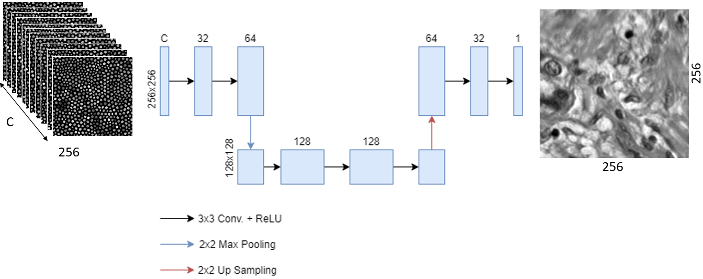

<h1 align="center"> Fibre bundle image reconstruction using convolutional neural networks and bundle rotation in endomicroscopy </h1>

Multi frame super resolution (MFSR) has been thought of the next step in certain super resolution pracices. With the introduction of using multiple images with high temperal resolution they can be combined to form a single high resolution (HR) image.

The dataset used in this project was aquired using a custom build setup of a slide provided by Wael Ageeli.

# 1.0 Getting started:
Requirements:
- Python 3.9 
- Tensorflow 2.6
- Numpy 1.21.2
- Matplotlib 3.5.1
- opencv-python 4.5.5.62
- scikit-image 0.19.1
- tqdm 4.62.3
- scipy 1.7.1

This code was tested using Microsoft visual studio 2019 version 16.11.3

Default order of execution
1. Preprocessing_Dataset.py
2. Train_MFAE.py 
3. Test_MFAE.py

Each file is described in detail below.
 
 
# 2.0 Python script notes
This project is broken down into three scrips. The frist proccesses the original images and outputs the stacked training, validation and testing datasets to be used by the model in training and testing. The other two contain the code to train and test the MF-UNet model respectively. Each code is broek down into sections below.

## 2.1 Preprocessing_Dataset.py
The preprocessing python script is split into three sections. 
- The first divides the original images into 256x256 slices that will be used as the HR ground truth. 
- The slices are then Overlayed with the selected binary fibre bundle mask, the mask is rotated three times to produce four images of the same spot but with cores in different locations, synthetically creating a higher temporal resolution. Each set of four LR images are added into an array of N,256,256,4 where N is the number of slices. 
- The final section saves the arrays into an output folder as ".npy" so they can be read in easier.

## 2.2 Train_MFAE.py
To train the model the script is again split into three sections for easier use. 
- The first section loads the preprocessing training output datasets into their respective variables. The datasets are then split into an 80/20 for training and validation respectively.
- The model is then loaded along with the optimiser and loss functions required for training the model using the dataset.
- Finally the model is compiled with the optimiser and loss funtion, then trained using the dataset. Once the training is complete the model is saved into a specified folder. This will be used to load the model for testing.

## 2.3 Test_MFAE.py
Finally the testing script has two sections for use and one section that has been set to false as it's used for testing the output.
- The first section, loads the LR and HR testing datasets created by the preprocessing script along with the trained model created by the previous script. Note: The HR images are only loaded for displaying a comparison of SR images.
- Each of the images in the testing dataset are then input into the model and a predicted output image is returned which is then saved into a separate folder.
- The middle section of this code is only used for testing purposes. The code will only input one image into the model and display a figure containing the ground truth, low resolution and super resolution image. None of these images are saved.
